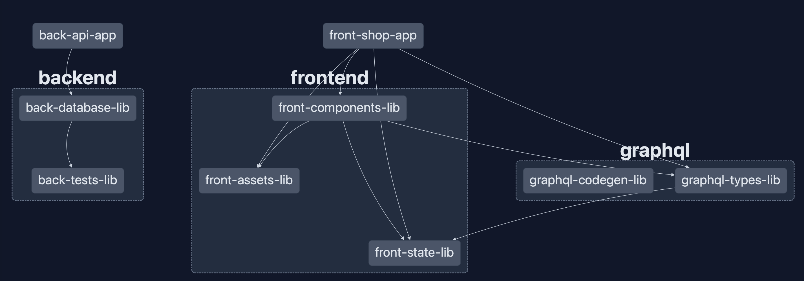

# graphql-shop

Toying with graphql by coding a simple webshop app.

<!-- readme-package-icons start -->

<p align="left"><a href="https://docs.github.com/en/actions" target="_blank"></a>&nbsp;<a href="https://www.typescriptlang.org/docs/" target="_blank"></a>&nbsp;<a href="https://nodejs.org/en/docs/" target="_blank"></a>&nbsp;<a href="https://pnpm.io/motivation" target="_blank"></a>&nbsp;<a href="https://fly.io/docs/" target="_blank"></a>&nbsp;<a href="https://docs.docker.com" target="_blank"></a>&nbsp;<a href="https://www.postgresql.org/docs/" target="_blank"></a>&nbsp;<a href="https://www.apollographql.com/docs/react/" target="_blank"></a>&nbsp;<a href="https://babeljs.io/docs/en/" target="_blank"></a>&nbsp;<a href="https://docs.cypress.io/guides/overview/why-cypress" target="_blank"></a>&nbsp;<a href="https://eslint.org/docs/latest/" target="_blank"></a>&nbsp;<a href="https://expressjs.com/en/starter/installing.html" target="_blank"></a>&nbsp;<a href="https://fakerjs.dev/guide/" target="_blank"></a>&nbsp;<a href="https://graphql.org/learn/" target="_blank"></a>&nbsp;<a href="https://www.i18next.com/overview/getting-started" target="_blank"></a>&nbsp;<a href="https://jestjs.io/docs/getting-started" target="_blank"></a>&nbsp;<a href="https://jotai.org/docs/introduction" target="_blank"></a>&nbsp;<a href="https://jwt.io" target="_blank"></a>&nbsp;<a href="https://docs.nestjs.com" target="_blank"></a>&nbsp;<a href="https://nextjs.org/docs/getting-started" target="_blank"></a>&nbsp;<a href="https://nx.dev/getting-started/intro" target="_blank"></a>&nbsp;<a href="https://www.passportjs.org/docs/" target="_blank"></a>&nbsp;<a href="https://prettier.io/docs/en/index.html" target="_blank"></a>&nbsp;<a href="https://www.prisma.io/docs/" target="_blank"></a>&nbsp;<a href="https://reactjs.org/docs/getting-started.html" target="_blank"></a>&nbsp;<a href="https://react-hook-form.com/get-started" target="_blank"></a>&nbsp;<a href="https://tanstack.com/query/v4/docs/overview" target="_blank"></a>&nbsp;<a href="https://rxjs.dev/guide/overview" target="_blank"></a>&nbsp;<a href="https://tailwindcss.com/docs/installation" target="_blank"></a>&nbsp;<a href="https://testing-library.com/docs/" target="_blank"></a>&nbsp;<a href="https://github.com/typestack" target="_blank"></a>&nbsp;<a href="https://webpack.js.org/concepts/" target="_blank"></a>&nbsp;<a href="https://github.com/colinhacks/zod#introduction" target="_blank"></a>&nbsp;<a href="https://graphql.org/learn/" target="_blank"></a></p>

<!-- readme-package-icons end -->

## ⚡ Quickstart

### 🔶 Launching database instance

```bash
pnpm docker-db
```

### 🔶 Seeding database

```bash
pnpm docker-db-seed
```

### 🔶 Launching frontend and backend services

```bash
pnpm dev
```

### 🔶 Launching tests

```bash
pnpm nx run-many --target=test --all
```

## ⚡ Subject

The purpose of our app will be to sell products to customers by allowing them to place orders. This gives us several features to address, typical for an online webapp store:

- Products display, filtering and actions
- Shopping cart
- Login / Signup
- Shipping options
- Payment mockup
- Orders history

## ⚡ Stack

### 🔶 Tooling - [pnpm](https://pnpm.io) | [nx](https://nx.dev/getting-started/intro) | [graphql-codegen](https://github.com/dotansimha/graphql-code-generator)

#### 🧿 nx

nx is a great tool for monorepos. It will allow us to define both our backend and our frontend in the same repo. We will also split up the codebase further with the use of nx libraries.



#### 🧿 Graphql Codegen

We are using a tool to generate code based on react-query from the backend graphql schema and graphql code defined in our frontend. Here is a little schema:


- On the backend, our graphql schema is an autogenerated file from nest graphql module, which based on apollo server.
- On the frontend, we start by defining atomic queries/mutation in graphql; these files are pulled by the codegen tool to autogenerate react-query queries/mutations, along with their related types.

Generation is as simple as executing this command:

```bash
pnpm nx fetch lib-graphql-codegen
```

### 🔶 Backend - [nest](https://docs.nestjs.com) | [prisma](https://www.prisma.io/docs/getting-started)

We are using nest graphql module to define what will be exposed on the graphql schema. Nest module is very similar to [typegraphql](https://typegraphql.com): we define resolvers that will contain functions annotated with decorators defined in `@nestjs/graphql` to define our queries, mutations and fields resolution.

These resolvers rely on a service layer that is responsible for the interaction with our database, using prisma ORM.

### 🔶 Frontend - [next](https://nextjs.org/docs/getting-started) | [jotai](https://jotai.org/docs/introduction) | [react-query](https://tanstack.com/query/v4/docs/overview) | [tailwind](https://tailwindcss.com/docs/installation)

As for frontend, the api layer is already resolved for us thanks to the codegen mentioned earlier. We do need some transient state however. I elected jotai for this, which is very flexible, simple and elegant.

All we have to do is to define atomic state that can then be consumed anywhere in the components tree.

### 🔶 Deployment - [docker](https://docs.docker.com) | [vercel](https://vercel.com/docs) | [fly.io](https://fly.io/docs/)

Frontend deployment is really easy thans to vercel. However, when it comes to backend, we have several choices, some more onerous than others. I personally chose fly.io as a replacement for heroku free dynos.

## ⚡ Database


### 🔶 Creating a new migration

```bash
pnpm prisma-migrate <migration_name>
```

### 🔶 Seeding database manually

```bash
pnpm prisma-seed
```
